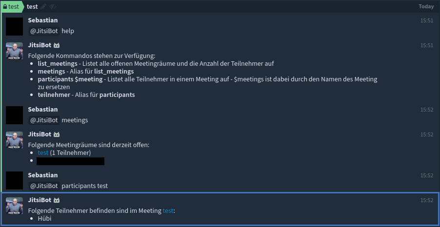

# mod_zulip_roominfobot

A module for Jitsi's XMPP server, which provides an HTTP endpoint that can be used to request information about open conferences via [Zulip](https://zulipchat.com/).

## Example



This picture is from the Zulip server of the company where I work. The texts in this version are in English.

## Running with

* Prosody 0.10 (Default for Jitsi Meet stable): **Yes**
* Prosody 0.11: **Should**

## Installation

### Zulip

1. go to **Menu -> Settings -> Your Bots -> Add a new bot**
   * **Typ**: Outgoing Webhook
   * **Name**: Choose your bot name
   * **E-Mail address**: Choose the bots email address
   * **Endpoint-URL**: The URL where the POST request is send to, e.g. https://meetings.example.com/roominfobot
   * **Outgoing webhook message format**: Zulip
2. press **Create bot**
3. go to **Active bots**
4. download the **zuliprc** file from your bot
   * you'll find the **token** in this file, which you need at point 9. of **Jitsi Server** configuration

### Jitsi Server

1. open `/etc/prosody/prosody.cfg.lua` and add the line `http_host = "meetings.example.com"` (replace the domain with yours)
2. save and close the configuration
3. open `/etc/prosody/conf.d/meetings.example.com.cfg.lua` (replace the filename with your domain) and add the following line:

```
plugin_paths = { "/usr/local/lib/prosody/modules/" }
```
   * if this line already exists put the module in this folder, or add your path to the `plugin_paths` table
5. now search the following line:

```
Component "conference.meetings.example.com" "muc"
```
6. add the following under this line:

```
modules_enabled = { "zulip_roominfobot"; }
allowed_zulip_bots = { "$token" }
```
   * if the `modules_enabled` already exists, add `"zulip_roominfobot"` to it
   * replace `$token` in `allowed_zulip_bots` with the bot token which you can find in the **zuliprc** file
      * you can add multiple bot tokens to the table `allowed_zulip_bots` to allow multiple bots using the endpoint
7. save and close the configuration
8. clone this repository into the folder you defined at point 3
   * or create a subfolder with the name `mod_zulip_roominfobot` and copy the three `.lua` from this repository into it
9. Restart prosody

If the plugin is loaded correctly, then you can send `POST` requests to http://meetings.example.com:5280/zulip_roominfobot.

### NGINX

* If you use NGINX as reverse proxy you can add the following to it:

```
location /roominfobot {
    proxy_set_header X-Forwarded-For $remote_addr;
    proxy_set_header Host $http_host;
    proxy_pass http://127.0.0.1:5280/zulip_roominfobot;
}
```

